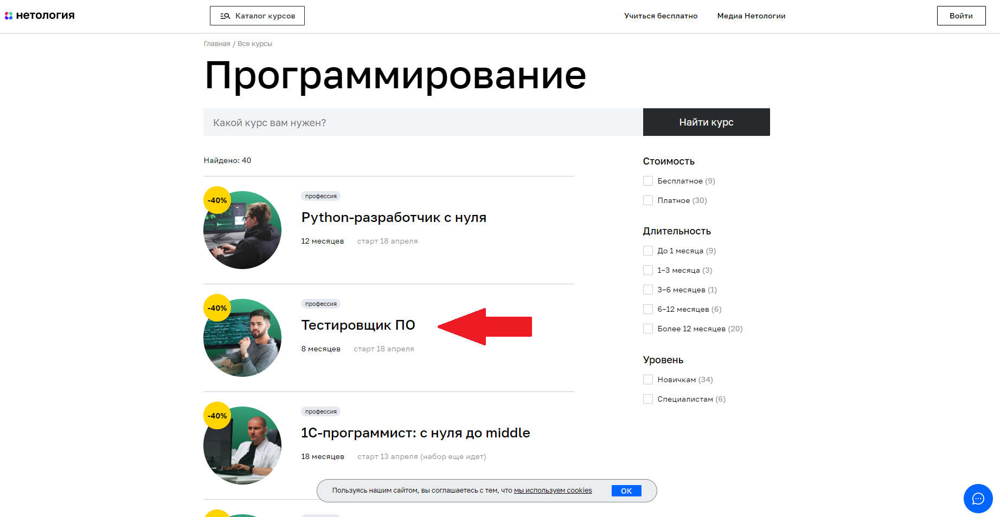
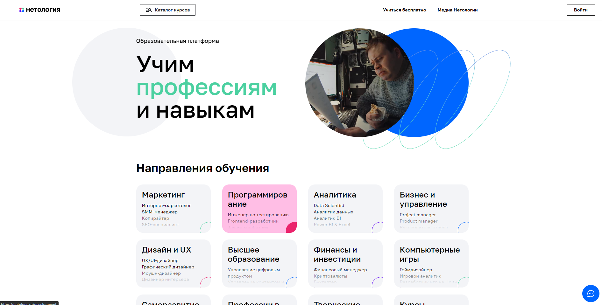
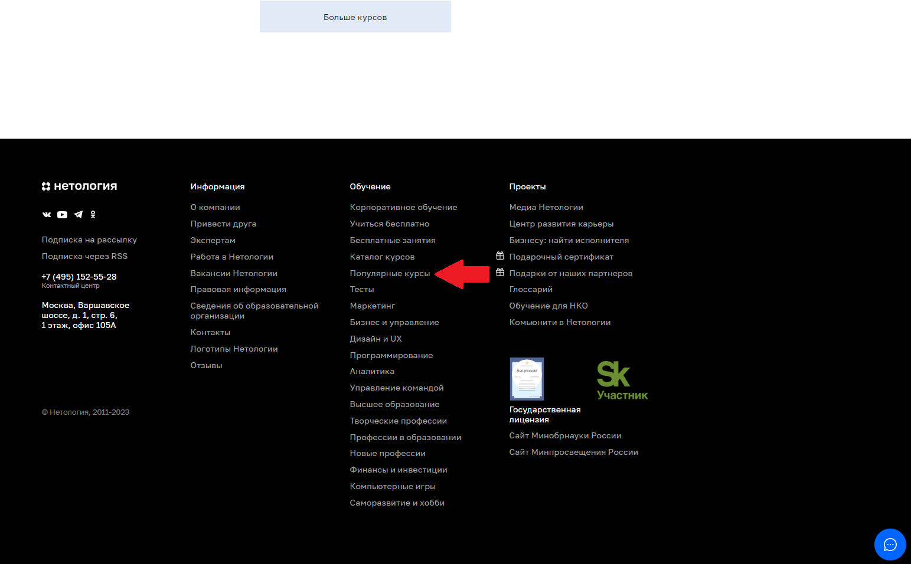
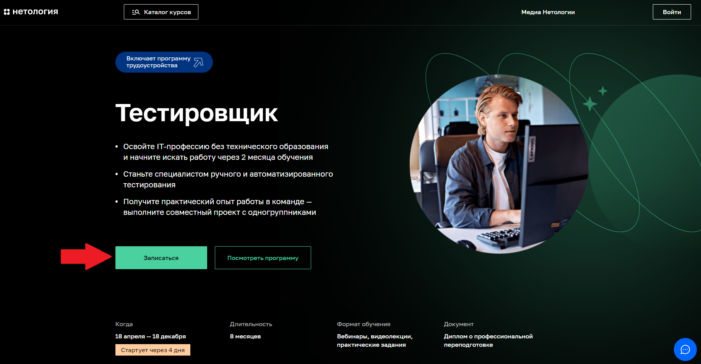
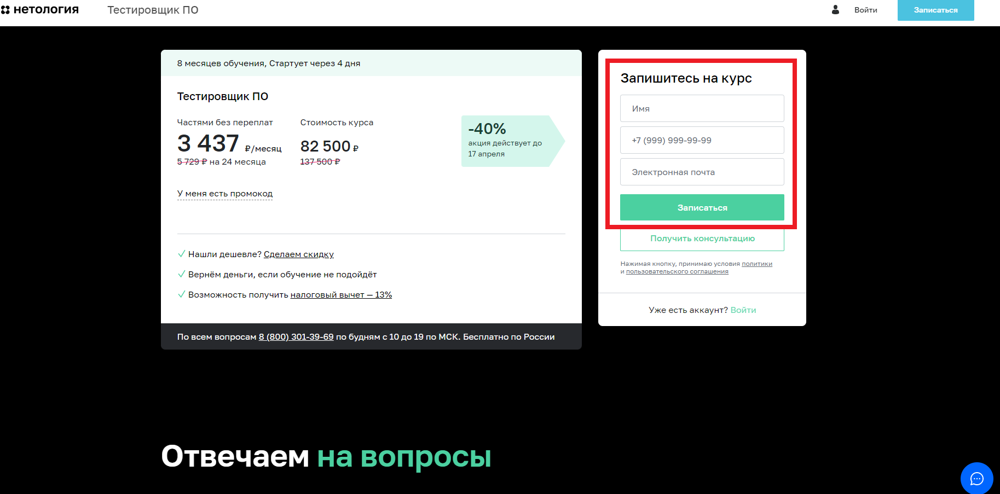
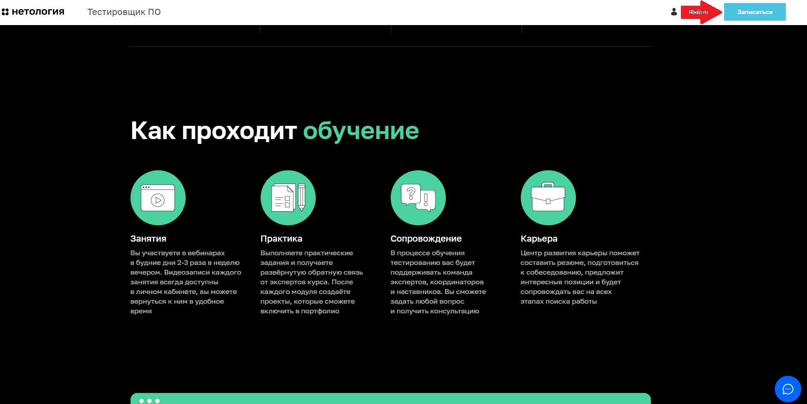

# Тест план: автоматизированное тестирование возможности записаться на обучение профессии "Тестировщик ПО": #

## Перечень автоматизируемых сценариев: 
### Тестовый сценарий перехода на страницу записи обучению профессии "Тестировщик ПО":  ###
**Тестовый сценарий № 1** «Переход на страницу записи обучению профессии "Тестировщик ПО" через «Каталог курсов» на главной странице сайта Нетология».
1.	Переходим на главную страницу сайта [Нетология](https://netology.ru/).
2.	Нажать на кнопку «Каталог курсов» в шапке сайта.

3.	Нажать на кнопку «Программирование».

4.	В открывшейся [странице](https://netology.ru/development) нажать на вкладку «Тестировщик ПО».

**Тестовый сценарий № 2** «Переход на страницу записи обучению профессии "Тестировщик ПО" через вкладку "Программирование" на главной странице сайта Нетология».
1.	Переходим на главную страницу сайта [Нетология](https://netology.ru/).
2.	Нажать на вкладку «Программирование» в разделе "Направления обучения".

3. Нажать на вкладку «Тестировщик ПО».

**Тестовый сценарий № 3** «Переход на страницу записи обучению профессии "Тестировщик ПО" через вкладку "Популярные курсы" в футере главной странице сайта Нетология».
1.	Переходим на главную страницу сайта [Нетология](https://netology.ru/).
2.	Нажать на вкладку «Популярные курсы» в футере сайта.

3. Нажать на вкладку «Тестировщик ПО».

### Тестовый сценарий заполнения формы на обучение профессии "Тестировщик ПО":  ###
**Тестовый сценарий № 1** «Заполнение формы записи на обучение профессии "Тестировщик ПО" через кнопку "Записаться"».
1. Нажать кнопку "Записаться" в начале страницы профессии "Тестировщик".

2. Ввод валидных данных в поле "Имя" в форме "Запишитесь на курс".
3. Ввод валидных данных в поле "+7 (999) 999-99-99" в форме "Запишитесь на курс".
4. Ввод валидных данных в поле "Электронная почта" в форме "Запишитесь на курс".
5. Нажать кнопку "Записаться" в форме "Запишитесь на курс".

**Тестовый сценарий № 2** «Заполнение формы записи на обучение профессии "Тестировщик ПО" через кнопку "Записаться" в хедере».
1. Листать вниз страницу до появления кнопки "Записаться" в хедере сайта.
2. Нажать кнопку "Записаться" в хедере сайта.

2. Ввод валидных данных в поле "Имя" в форме "Запишитесь на курс".
3. Ввод валидных данных в поле "+7 (999) 999-99-99" в форме "Запишитесь на курс".
4. Ввод валидных данных в поле "Электронная почта" в форме "Запишитесь на курс".
5. Нажать кнопку "Записаться" в форме "Запишитесь на курс".

**Тестовый сценарий № 3** «Заполнение формы записи на обучение профессии "Тестировщик ПО" напрямую через форму "Запишитесь на курс».
1. Пролистать страницу вниз до появления формы "Запишитесь на курс".
2. Ввод валидных данных в поле "Имя" в форме "Запишитесь на курс".
2. Ввод валидных данных в поле "+7 (999) 999-99-99" в форме "Запишитесь на курс".
3. Ввод валидных данных в поле "Электронная почта" в форме "Запишитесь на курс".
4. Нажать кнопку "Записаться" в форме "Запишитесь на курс".

